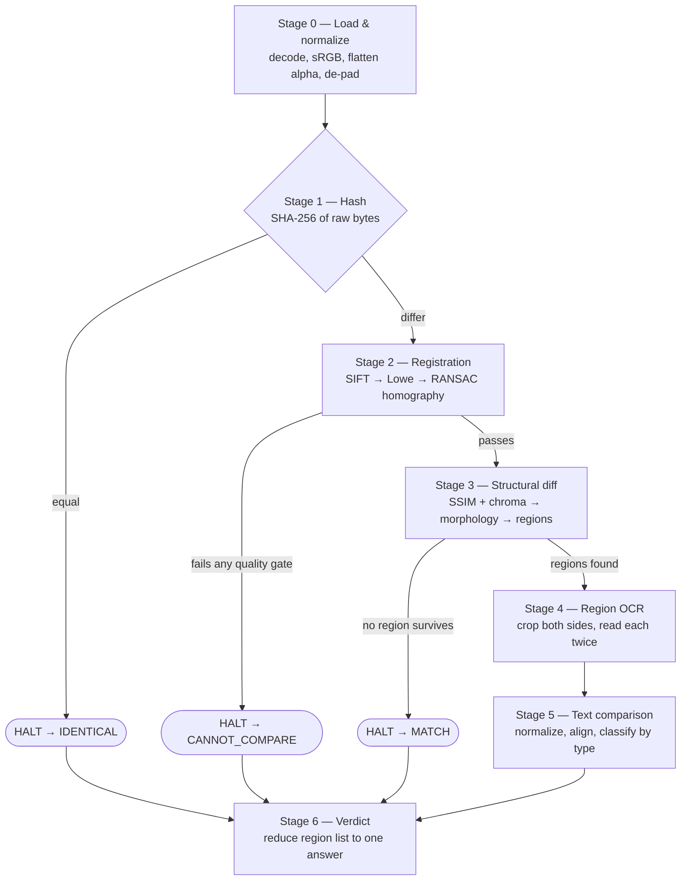

# How it works

A walk through the pipeline, in order, in plain language: what each step does, what
algorithm it uses, why that algorithm and not another, and — at every point where
the pipeline can go two ways — what decides which way it goes.

Companion documents: [README.md](README.md) for what this build is and how to run
it, [USER-GUIDE.md](USER-GUIDE.md) for operating it, [RESULTS.md](RESULTS.md) for
measured accuracy, and [../TECHNICAL.md](../TECHNICAL.md) for the
version-identification build this one is cut down from.

---

## 1. The shape of the problem

Two images come in: a **reference** (the brand's artwork file) and a
**marketplace** image (what a listing is actually serving). One answer comes out:

| Verdict | Meaning |
|---|---|
| `IDENTICAL` | Byte-for-byte the same file. Proof, not an estimate. |
| `MATCH` | Same artwork. Only re-encoding separates the two images. |
| `MATCH_WITH_COSMETIC_DIFFERENCES` | Same claims, written or coloured differently. |
| `DIFFERENT` | At least one change alters what the pack says. |
| `NEEDS_REVIEW` | Something differs; the tool will not settle it alone. |
| `CANNOT_COMPARE` | The two images could not be lined up well enough to compare. |

The last two are **designed outcomes, not failures**. The whole pipeline is built
so that when evidence runs out it says so, rather than guessing. `CANNOT_COMPARE`
is also the *default*: [core/engine.py](backend/core/engine.py) returns it if no
stage ever established anything better, so a crash or a gap can never be read as a
pass.

Everything else in this document is machinery in service of that one question.

---

## 2. The whole flow on one page



Three properties hold across the whole chain:

1. **Every stage emits a trace row**, including on the failure path. A stage that
   raises gets a `FAILED` row carrying the exception; stages after a halt get a
   `SKIPPED` row saying why. There is no path that produces a comparison with a
   missing stage. The trace is the product — the frontend exists to display it.
2. **A halt is a verdict, not an absence of one.** When a stage halts, the verdict
   stage still runs and records the answer the halt implies.
3. **Nothing is recomputed.** The normalized images, the homography and the
   difference map are each produced once and threaded through `PairContext`.

---

## 3. Stage 0 — Load and normalize

**File:** [core/stages/load_normalize.py](backend/core/stages/load_normalize.py),
using [core/imaging/loader.py](backend/core/imaging/loader.py) and
[core/imaging/geometry.py](backend/core/imaging/geometry.py).

**Job:** undo everything a marketplace did to the image that is not a real change.

### Decode → sRGB → flatten alpha

Pillow decodes the file. If it carries an ICC colour profile, `ImageCms` converts
it to sRGB, so two copies of one file tagged in different colour spaces still
compare equal. Transparency is composited onto white, which is exactly what a
marketplace does when it publishes a PNG with alpha. Result: an H×W×3 uint8 RGB
array, deterministic for a given input.

### De-padding — MAD border detection

Marketplaces pad artwork into a square canvas. That padding is not a difference,
and worse, leaving it on means the two images are at different *scales*.

**The algorithm.** For each row and each column, compute the **mean absolute
deviation from that line's own median**. A row of flat padding has a deviation near
zero; a row crossing artwork does not. Scan inward from each edge while the
deviation stays under a tolerance (10.0), stopping at a cap of 30% of the
dimension.

**Why MAD and not max-minus-min.** JPEG rings for several pixels either side of a
hard padding edge. A max-minus-min test trips on that ringing and stops the scan
early — by a different amount per encoder and per quality setting. A robust
statistic ignores the few rung pixels and finds the true edge. The leftover sliver
of padding would otherwise become a scale error that smears every glyph.

**Sub-pixel refinement.** The integer scan can only say "this row is content, the
one before it was padding", so it carries up to half a pixel of error. Real padding
rarely lands on a whole pixel — a 1500px canvas padded by an eighth then resized to
800 puts the true edge at 66.67. So the deviation profile is interpolated to find
where it crosses the **midpoint between the padding level and the content level**,
and the content rectangle is resampled onto a whole-pixel grid with a bilinear
warp (a sub-pixel *shift*, not a resize).

### The deliberate non-decision

The two images are **not** resized to a common size here. Registration handles
scale, and forcing a resize first destroys information the homography needs: an
800px marketplace image upscaled to a 1500px reference has no more detail, but it
does have interpolated edges that shift keypoints.

**Branches:** none. This stage always runs and always continues.

---

## 4. Stage 1 — Hash

**File:** [core/stages/hash_exact.py](backend/core/stages/hash_exact.py)

**Algorithm:** SHA-256 over each file's **raw bytes**, streamed in 1MB chunks.

Never over decoded pixels — decoding depends on library versions, so a pixel hash
would not be stable across environments, and stability is the entire point.

> ### ⑂ Branch 1 — hashes equal?
>
> **Equal** → verdict `IDENTICAL`, confidence 1.0, **pipeline halts**. This is
> proof rather than an estimate, and the UI says so outright.
> **Differ** → continue. This says nothing yet; marketplaces almost always
> re-encode, so this stage rarely fires on real data.

---

## 5. Stage 2 — Registration

**File:** [core/stages/registration.py](backend/core/stages/registration.py)

**Job:** find the geometric transform that puts the reference on top of the
marketplace image, and **refuse if that transform is not trustworthy**.

This is the stage that makes the build worth having. The version-identification
build recovers alignment with phase correlation — an integer translation, nothing
more — which works only while the marketplace image really is a re-encoded copy of
the brand's file. A homography works whether it is a copy **or** a third-party
photograph taken at an angle.

### 5.1 Detect keypoints — SIFT, with ORB as fallback

**SIFT** (Scale-Invariant Feature Transform) finds points that look the same
regardless of size or rotation. It builds a scale pyramid by blurring the image
repeatedly, looks for blob-like extrema across neighbouring scales, and describes
each surviving point by a 128-number histogram of the gradient directions around
it. Two images of the same pack produce descriptors that are close in that
128-dimensional space even if one was shot at an angle.

Up to 6000 features per image.

> ### ⑂ Branch 2 — enough SIFT keypoints?
>
> If **either** image yields fewer than 100 SIFT keypoints, try **ORB** instead and
> keep whichever detector found more. ORB is a fast corner detector (FAST corners +
> a binary BRIEF-style descriptor) and it finds structure where SIFT's blob
> response starves — which is what happens on flat, high-contrast packaging with
> large areas of solid colour and little texture.
>
> The spec calls for AKAZE here. OpenCV 5's Python bindings do not ship it; ORB
> fills the same role. (Deviation 1 in the README.)

> ### ⑂ Branch 3 — any usable detail at all?
>
> Fewer than 4 keypoints, or no descriptors, on either side → **refuse**:
> "Almost no distinctive detail was found in one of the images."

### 5.2 Match — brute force plus Lowe's ratio test

Every reference descriptor is compared against every marketplace descriptor (L2
distance for SIFT, Hamming for ORB's binary descriptors), keeping the **two**
nearest for each.

**Lowe's ratio test.** Keep a match only if the best candidate is clearly better
than the runner-up: `best.distance < 0.75 × second_best.distance`.

*Why it works.* Packaging is full of repeated texture — the same letterform appears
in twenty places. A repeated pattern's best and second-best matches are nearly
equally good, so the ratio is close to 1 and the match is thrown out. A genuine
landmark has one obviously best match, so the ratio is small. This is a test for
*distinctiveness*, not for closeness, and it is what stops the transform being
fitted to ambiguous points.

> ### ⑂ Branch 4 — at least 4 matches survive the ratio test?
>
> Fewer than 4 → **refuse**. Four correspondences is the algebraic minimum for a
> homography; below it there is nothing to fit.

### 5.3 Fit — RANSAC homography

A **homography** is a 3×3 matrix mapping one flat plane onto another. It covers
translation, rotation, scale, shear and perspective — enough to describe a pack
front photographed off-axis, which an affine transform cannot.

**RANSAC** (RANdom SAmple Consensus) fits it in the presence of wrong matches:

1. Pick 4 matches at random.
2. Solve for the homography they imply.
3. Apply it to every other match and count how many land within **3.0 pixels** of
   where they should — the *inliers*.
4. Repeat up to 5000 times, keep the model with the most inliers, then refit using
   all of them.

Fitting to all matches at once with least squares would be dragged off by a handful
of bad ones; RANSAC lets the majority that agree define the answer and simply
ignores the rest.

Four numbers are then measured from the result:

- **inliers** — how many points agree.
- **mean reprojection error** — how far, on average, an inlier lands from where
  the transform predicts.
- **condition number** — `np.linalg.cond(H)`. How close the matrix is to being
  degenerate, i.e. to squashing the whole reference onto a line.
- **implied scale and rotation** — from the 2×2 affine block: `sqrt(|det|)` is the
  isotropic scale, `atan2(H[1,0], H[0,0])` the rotation. Sanity checks; a nonsense
  match usually announces itself here first.

> ### ⑂ Branch 5 — the quality gates (four ways to refuse)
>
> A homography that *converged* is not the same as a homography that is any good.
> Eighteen inliers clustered in one corner produce a transform, and everything
> downstream would then treat two unrelated images as aligned. So:
>
> | Gate | Threshold | Refuses when |
> |---|---|---|
> | inlier count | `< 15` | too few points agree to trust the alignment |
> | condition number | `> 1e6` | the transform is degenerate — a collapse, not a match |
> | implied scale | outside `0.25–4.0` | the resize needed is implausible for one artwork |
> | overlap fraction | `< 0.30` | after warping, the two share too little of the frame |
>
> Any gate fires → verdict `CANNOT_COMPARE`, **pipeline halts**.

### 5.4 Warp

The reference is warped into the marketplace frame with `warpPerspective` (bilinear
interpolation, white border). A second warp of a solid-white image through the same
matrix, nearest-neighbour, produces the **overlap mask**: which marketplace pixels
have a reference pixel behind them. Only that shared area is ever compared.

### 5.5 Confidence

Three independent ways the alignment can be bad, **multiplied**:

```
count_term   = min(1, inliers / (2 × inliers_ok))       inliers_ok = 30
error_term   = max(0, 1 − reprojection_error / 3.0)
overlap_term = min(1, overlap_fraction / 0.8)
confidence   = count_term × error_term × overlap_term
```

Multiplied rather than averaged: an alignment that is excellent on two counts and
catastrophic on the third is not two-thirds good, it is unusable.

Between 15 and 30 inliers the stage continues but marks itself `DEGRADED` — enough
to proceed, with a warning that a weak alignment makes unchanged detail look
changed.

### 5.6 Artefacts

`keypoint_matches` (inliers only — drawing all the ratio-test survivors produces a
hairball that looks like evidence and is not), `warped_reference`, `overlap_mask`,
and the **checkerboard**: alternating squares taken from each image. If the artwork
runs continuously across a square boundary the alignment is right; if it steps, it
is not. No number communicates that as directly.

---

## 6. Stage 3 — Structural diff

**File:** [core/stages/structural_diff.py](backend/core/stages/structural_diff.py)

**Job:** propose candidate regions to read. **Tuned for recall, not precision** —
its output is candidates, not findings. A false region costs one OCR call; a missed
region is invisible forever.

### 6.1 Shrink the valid area

The warp interpolates along the overlap boundary, and that seam is not a change in
the artwork. The valid mask is eroded by 8px first.

One subtlety that was a real bug: `cv2.erode` defaults to a border value of +∞, so
a mask reaching the frame edge is **not eroded there at all** — which is exactly
where the artefacts are. The call passes `borderType=BORDER_CONSTANT,
borderValue=0`. Without it, the artwork's trim ticks and the de-padding boundary
proposed a dozen junk regions along every edge, one of which became a false
material finding on *unchanged* artwork.

### 6.2 Luma channel — SSIM

**SSIM** (Structural SIMilarity) compares two images over a sliding window — here
7×7 — and asks three questions per window: do the two have similar **brightness**
(mean), similar **contrast** (variance), and do they **vary together**
(covariance)? The three terms multiply into a score from −1 to 1, and the map of
per-pixel scores is what this stage uses.

**Why SSIM and not `|a − b|`.** Registration is never pixel-exact, and illumination
and white balance differences make raw subtraction useless on a photographed pack:
a slightly warmer light source moves every pixel by more than a changed digit does.
SSIM asks whether the local *structure* matches, which survives both a half-pixel
misalignment and a uniform brightness shift.

The map is rescaled to `d_ssim = (1 − ssim) / 2`, putting "structurally identical"
at 0 and "structurally opposite" at 1.

### 6.3 Chroma channel — separately

Both images are converted to YCrCb and the two colour-difference channels are
compared: `d_chroma = max(|ΔCr|, |ΔCb|)`, then box-blurred over the **same 7×7
window** as SSIM so the two are locally comparable statistics rather than a window
measure against a point measure.

**Why separately.** A pure palette change moves chroma while barely moving luma, so
an SSIM map computed on grayscale alone is blind to a repainted pack. That was a
real bug in the version-identification build, found by measurement after 28 images
came back unidentified. It is not reintroduced here.

### 6.4 Combine — normalized by their own thresholds

```
score = max( d_ssim / ssim_threshold , d_chroma / chroma_threshold )
```

Each channel is divided by **its own** measured noise floor before the max is
taken. So `score > 1.0` means "louder than noise in whichever channel spoke
loudest", and everything downstream is threshold-free. Both thresholds come from
measurement, not from a guess — see §9.

Two masks are produced: `mask` (either channel over threshold) and `mask_luma`
(luma only). Both matter in a moment.

### 6.5 Morphology — clean up, then merge along the line

**Open** with a 3×3 square: erode then dilate. Removes isolated speckle — a
scattering of single pixels that clear the threshold by chance survives erosion
nowhere.

**Close** with a **31×7** rectangle: dilate then erode. Fills gaps, joining nearby
blobs into one.

The closing kernel is deliberately **anisotropic** — wide and short. The diff
proposes where pixels changed; OCR needs whole text *lines*. A square kernel of the
same width would bridge a nutrition table's rows into one blob; a narrow one leaves
a changed word as three fragments, and a crop of a fragment reads as nonsense,
which becomes a false material finding. Measured: unchanged artwork read as
`"hoco"` against `"Choco"`. (Deviation 4 in the README.)

### 6.6 Regions — connected components

`connectedComponentsWithStats` with 8-connectivity: flood-fill each blob of set
pixels, return its bounding box. Boxes are sorted top-to-bottom then left-to-right,
so the region list is stable run to run and scans in reading order.

> ### ⑂ Branch 6 — is this a global recolour?
>
> A hue rotation decomposes into one component per coloured element. That is
> technically accurate and useless to review — the reviewer wants one row saying
> the palette moved, not fifty saying each badge did. Four conditions must **all**
> hold, because no one of them is sufficient:
>
> | Condition | Threshold | What it rules out |
> |---|---|---|
> | **spread** — union bounding box over the frame | `≥ 0.40` | a change confined to one corner |
> | **area** — fraction of pixels changed | `≥ 0.02` | a warm-lamp white-balance cast |
> | **count** — connected components | `≥ 10` | a single edited box |
> | **dominance** — share of changed pixels where chroma beat luma | `≥ 0.75` | a redesign, as opposed to a repaint |
>
> The area condition is what separates a repainted pack from a photograph taken
> under a warm lamp. Both are chroma-dominant and both reach across the frame; a
> hue rotation moves 9.2% of the area past threshold, a warm cast 0.4%. Measured
> on the corpus.
>
> **When it fires:** regions are taken from **`mask_luma` alone**, and one extra
> whole-frame region of kind `PALETTE` is prepended. Taking regions from luma means
> a recolour **cannot hide a changed number** — a colour shift barely moves the
> brightness structure, so an edited digit still surfaces as its own region.
> **When it does not:** regions come from the combined mask.

### 6.7 Filter and cap

- Boxes smaller than **0.05% of the overlap area** are dropped. This is ten times
  the version-identification build's floor, and deliberately so: there regions are
  per-digit against a noise-free reference-versus-reference diff; here they are
  merged to line level with a far higher noise floor. At 0.005% the artwork's trim
  ticks alone propose a dozen junk regions per edge. (Deviation 3 in the README.)
- More than **25** regions → keep the 25 largest, then re-sort into reading order.
  A cap, not a filter: a warped photograph can propose hundreds and OCR-ing all of
  them buys nothing.

> ### ⑂ Branch 7 — did any region survive?
>
> **None** → verdict `MATCH`, **pipeline halts**. There is nothing to read, and
> that reads as: the artwork matches.
> **Some** → continue to OCR.

**Confidence** here is *coverage*, not correctness: what fraction of the frame this
stage was able to inspect at all.

---

## 7. Stage 4 — Region OCR

**File:** [core/stages/region_ocr.py](backend/core/stages/region_ocr.py),
backends in [core/ocr/](backend/core/ocr/)

**Job:** read both sides of every proposed region, and — critically — work out
whether each reading can be trusted.

**The engine.** PP-OCR detection and recognition models, via `rapidocr-onnxruntime`
(ONNX Runtime) or PaddleOCR proper if it is installed. Both sit behind one
interface; nothing above the module knows which is running. Tokens are returned
with per-token confidences and boxes, then sorted into reading order (rows banded
by 0.6 × the median token height, then left-to-right) — because engines return
detections in *detection* order, and two crops read in different orders would
produce a spurious "words reordered" difference.

Tokens containing no ASCII letter or digit are dropped. A recognizer handed a crop
of a *graphic* — a certification mark, a logo — does not return nothing; it returns
its best guess at what those shapes spell, which on a circular organic mark is
something like `O 了`. Left in, that turns a region with no text into a region whose
text apparently changed.

### 7.1 Cropping

> ### ⑂ Branch 8 — is this the collapsed `PALETTE` region?
>
> **Yes** → skip reading entirely. A recolour has no text of its own, by
> construction: any text change would have surfaced as its own luma region. Both
> crops are still written as artefacts so the UI can show them.
> **No** → read it.

**Padding is measured against the region's height, not its width.** A proportional
10% pad gives a 25px-tall box 2.5px of room, which cannot recover a word the region
clipped — and a clipped word reads as nonsense, which becomes a false material
finding. Region height is a good proxy for line height, so the horizontal pad is
roughly 1.2 line heights. Vertical padding stays small, because growing vertically
pulls in the lines above and below.

With a cap: `line_height = min(h, max(w × 2, 8))`. A 4×193 sliver at a de-padding
boundary has no line height at all, and padding it by 1.2 × 193 = 232px sweeps in a
whole column of the nutrition table. Measured: that produced a false material
finding on unchanged artwork.

**The reference crop comes from the original reference, not the warped copy.** The
warp resamples the reference into the marketplace frame, which on a downscaled
listing throws away exactly the resolution the reference had and the marketplace
lacked. The box is mapped back through the **inverse homography** — one matrix
multiply — and cropped at full resolution.

Crops whose long edge is under 300px are upscaled bicubically (up to 3×, hard cap
at 2400px). Small text recognizes far better upscaled, and the cost is irrelevant
at this volume.

### 7.2 Calibrating the reader against itself

With one reference and one marketplace image there is **no second opinion available
anywhere in the system** — no other candidate to rank against, no second version to
diff. The only remaining evidence about whether a reading is trustworthy is the
reader's own stability.

> ### ⑂ Branch 9 — did either side read any text?
>
> **Yes** → re-read **both** crops at 1.6× the original scale. If either side's two
> readings disagree after normalization, the region is `ocr_reliable = False`.
> **No** → skip the re-read; there is nothing to be unstable about.
>
> The spec calls for re-reading only the reference. The marketplace image is the
> degraded one, so checking only the reference checks the easy side. Measured: a
> glare-damaged crop read `"coffee ee"` against `"Coffee"` and would have been
> reported as a material change. (Deviation 5 in the README.)
>
> The re-read triggers when *either* side found text, not only the side that read
> something — because text on one side and nothing on the other is precisely the
> case that matters most.

### 7.3 The ink-ratio guard

Text on one side and nothing on the other is either a **removal** or a **failed
read**, and the strings alone cannot tell them apart. The pixels can.

**Algorithm.** "Ink" is edge energy: the mean absolute **Laplacian** response. The
Laplacian is the second spatial derivative — it is near zero on flat areas and
spikes at edges. Printed text is almost entirely edges, so a crop that genuinely
lost its text loses most of its edge energy, while a crop whose text was merely
misread keeps it.

> ### ⑂ Branch 10 — asymmetric reading, is the ink still there?
>
> `ink_ratio = laplacian_energy(marketplace) / laplacian_energy(reference)`
>
> **≥ 0.55** → `ink_intact = True`: the printing is still present on both sides and
> the reader simply failed. The region is marked unreliable, and stage 5 turns this
> into "reading failure, not a change".
> **< 0.55** → the ink really is gone. Treated as a genuine difference.

### 7.4 Reliability, summarised

A region is `ocr_reliable` only if **all** of: an engine is installed, both sides
re-read the same, no token fell below 0.55 confidence, and the ink guard did not
fire. Stage confidence is the share of regions that cleared all four.

> ### ⑂ Branch 11 — is an OCR engine installed at all?
>
> **No** → the `NullOcr` backend returns empty readings *and* advertises
> `available = False`, marking every region unreliable and routing every difference
> to `UNCERTAIN`. Returning empty strings from a working-looking engine would make
> every region read as "no text on either side" — `VISUAL_ONLY` — which is a
> confident claim the installation has no basis for.

---

## 8. Stage 5 — Text comparison

**Files:** [core/stages/text_compare.py](backend/core/stages/text_compare.py)
(thin), [core/textnorm.py](backend/core/textnorm.py) (the work).

**The governing rule: classify by type, never by string equality.** `"450"` and
`"450.0"` are the same number and must not fire. `"450mg"` and `"480mg"` are
different numbers and must. `"450mg"` and `"45Omg"` differ by one confusable
character and are almost certainly one misread of the same value, so they go to
`UNCERTAIN` rather than to either confident answer.

### 8.1 Normalization

In this order, and the order matters:

1. **NFKC** Unicode normalization — turns a full-width digit or a ligature into the
   plain character everything else is written against. First, because everything
   downstream is written against plain characters.
2. Dash variants unified, non-breaking spaces replaced, whitespace collapsed,
   case-folded.
3. Per token: strip trailing punctuation; strip *leading* punctuation **unless** it
   is a decimal point in front of a digit (`.5 g` is a real packaging convention,
   and stripping it turns half a gram into five).
4. **Number canonicalization** — `0.5`, `.5` and `0,5` become one string. A comma
   is read as a decimal separator only when followed by one or two digits,
   otherwise `1,250` would become `1.25`.
5. **Unit aliasing** — `gm`, `gms`, `gram`, `grams` → `g`; `calories` → `kcal`;
   `mcg`/`µg` → `ug`; and so on. Marketplaces and OCR are both inconsistent about
   these, and neither inconsistency is a change to the pack.
6. **Unit joining** — a bare number followed by a unit token merges: `450` + `mg` →
   `450mg`. Which of the two forms an engine returns depends on the kerning of the
   crop it was handed; without this, a value that never changed reads as a token
   count mismatch and therefore as a material difference.

### 8.2 Alignment

`difflib.SequenceMatcher` over the **token lists** produces opcodes: `equal`,
`replace`, `delete`, `insert`. This is a longest-common-subsequence match, so
inserting a word shifts nothing — everything after it still aligns.

Before that runs, one short-circuit: if the two token lists **concatenate to the
same string**, it is `NO_DIFFERENCE`. `"added sugar"` against `"added suga ar"`
contains the same characters in the same order; the recognizer put a token boundary
somewhere else, which is an artefact of the reader, not a change to the artwork.

### 8.3 Classifying one replaced pair — the decision ladder

Applied in this order (order is load-bearing):

| # | Test | Result | Severity |
|---|---|---|---|
| 1 | identical after normalizing | `NO_DIFFERENCE` | NONE |
| 2 | same characters, different spaces | `NO_DIFFERENCE` | NONE |
| 3 | **confusable characters** | `CONFUSABLE_CHARACTERS` | UNCERTAIN |
| 4 | both parse as numbers → same value, same unit | `NUMBER_FORMAT` | COSMETIC |
| 5 | both parse → same value, different unit | `NUMBER_AND_UNIT_CHANGED` | MATERIAL |
| 6 | both parse → different value **and** unit | `NUMBER_AND_UNIT_CHANGED` | MATERIAL |
| 7 | both parse → different value, same unit | `NUMBER_CHANGED` | MATERIAL |
| 8 | both are punctuation only | `PUNCTUATION_ONLY` | COSMETIC |
| 9 | a character doubled or dropped | `CONFUSABLE_CHARACTERS` | UNCERTAIN |
| 10 | anything else | `TEXT_CHANGED` | MATERIAL |

Deletions and insertions of whole tokens become `TEXT_REMOVED` / `TEXT_ADDED`
(MATERIAL), unless they are pure punctuation (COSMETIC).

**Why test 3 sits above the numeric branch.** `45O` parses as the number 45
carrying a unit called `"o"`, so a numeric comparison would report `450mg` against
`45O` as both the value *and* the unit having changed — a confident material
finding built entirely on a misread character. A real digit change such as 450 → 480
is not confusable, so it still reaches the numeric branch.

**What "confusable" means.** A closed table of the substitutions a recognizer
actually makes on packaging type: `0/O`, `0/Q`, `1/L`, `1/I`, `5/S`, `8/B`, `2/Z`,
`6/G`, `9/G`, `U/V`, plus multi-character sequences `rn/m`, `cl/d`, `vv/w`. Not a
general typo model — treating *any* single-character edit as "probably OCR" would
silently swallow real edits like 3 → 8. Compared case-insensitively via a
bailing-early **Levenshtein** distance capped at 1.

Test 9 is deliberately narrow: only a repeat of an *adjacent* character counts.
`450` → `4500` is not a repetition and stays material.

**The region takes its worst constituent difference**, ranked
MATERIAL > UNCERTAIN > COSMETIC > NONE.

### 8.4 The stage's own ladder

Before any of that is trusted, the stage applies five overrides, in order:

> ### ⑂ Branch 12 — five routes for one region
>
> 1. **kind is `PALETTE`** → `PALETTE_SHIFT` / COSMETIC. Classified from *pixel*
>    evidence, not text: the previous stage established the change is colour spread
>    across the pack while the brightness structure — the printing — is unchanged.
>    A recolour does not change what the pack claims.
> 2. **no text on either side** → `VISUAL_ONLY` / UNCERTAIN. A real visual change
>    with nothing to read: a removed certification mark is exactly this. Discarding
>    these would quietly make the system blind to every non-text edit.
> 3. **the text comparison found nothing** → `NO_DIFFERENCE` / NONE. Print or
>    compression difference. Expected — the diff stage over-proposes on purpose.
> 4. **`ink_intact`** → `NO_DIFFERENCE` / NONE, "reading failure, not a change".
> 5. **not `ocr_reliable`** → split on character similarity (whitespace stripped,
>    `SequenceMatcher.ratio()`):
>    - **≥ 0.75** → `NO_DIFFERENCE`. The reader wobbling on unchanged text.
>      Without this, 14 of 29 unchanged re-encoded pairs became review requests,
>      which buries the real ones.
>    - **< 0.75** → `OCR_UNRELIABLE` / UNCERTAIN. `450` against `480` scores 0.67
>      and stays reportable; `wholegrain` against `wholegraieain` scores 0.87 and
>      does not.
> 6. **otherwise** → whatever §8.3 decided.

---

## 9. Stage 6 — Verdict

**File:** [core/stages/verdict.py](backend/core/stages/verdict.py)

Always runs, even after a halt — because a halt *is* a verdict, and a comparison
with no verdict row would be a gap in the record.

### The table

```
if halted with IDENTICAL          → IDENTICAL                        (confidence 1.0)
if halted with CANNOT_COMPARE     → CANNOT_COMPARE                   (confidence 0.0)
if halted with MATCH              → MATCH
if any region is MATERIAL         → DIFFERENT
if any region is UNCERTAIN        → NEEDS_REVIEW
if any region is COSMETIC         → MATCH_WITH_COSMETIC_DIFFERENCES
otherwise                         → MATCH
```

Written as a table, deliberately, so that reading the code and reading the
specification are the same activity.

### Confidence is the weakest link, not the average

```python
confidence = min(stage.confidence for stage in traces if stage != "hash")
```

A comparison whose registration was excellent and whose OCR was unreadable is not
"fairly confident" — it is as confident as the OCR was. Averaging would let a
strong stage launder a weak one.

### Why the pipeline declines rather than guesses

There are two ways to be wrong and they cost wildly different amounts. Reporting
good artwork as changed sends someone to investigate a non-problem; a few of those
and the team stops trusting the tool. Declining costs one person one look.

---

## 10. Where the thresholds come from

**File:** [tools/calibrate.py](backend/tools/calibrate.py)

Two numbers govern the diff stage, and neither is guessed.

**Pass 1 — the noise.** Over pairs *known* to be unchanged (`IDENTICAL`,
`REENCODED`, `PHOTOGRAPHED` with no edits), register them and accumulate the
per-pixel `d_ssim` and `d_chroma` distributions across the valid overlap. This is
how much the structure of an image moves when nothing changed and it was merely
re-saved, resized, or photographed.

**Pass 2 — the signal.** Over pairs carrying a known edit, accumulate the same two
statistics *inside the ground-truth edit boxes*, mapped through the recovered
homography.

**The choice.** The threshold is the **99.9th percentile of the unchanged
distribution** — the point above which only one noise pixel in a thousand sits.

The spec asks for the 95th, tuned for recall. Taken literally on a 1500×1500 frame
that fires on 112,000 pixels of pure noise per pair, which survives the morphology
and proposes dozens of junk regions. The recall the spec wants is bought elsewhere
instead: by a generous region-area floor and by letting OCR discard what survives,
rather than by a generous per-pixel threshold. (Deviation 2 in the README.)

**As measured** (111 pairs, 9M unchanged pixels, in
[config/thresholds.json](config/thresholds.json)):

| | threshold (unchanged p99.9) | changed p99 | margin |
|---|---|---|---|
| structure `(1−SSIM)/2` | 0.38412 | 0.496207 | **+0.112086** |
| colour (chroma) | 20.4286 | 101.0 | **+80.5714** |

Positive margins on both channels: the two populations separate at the chosen
threshold. Where they would not separate, the tool reports that rather than
pretending. The histogram is written to `calibration/noise_floor.png` and shown on
the Settings screen, so a threshold value is never displayed without the
distribution it came from.

These thresholds **cannot be borrowed from the version-identification build**. That
build compares re-encoded copies of one file aligned by an integer translation;
this one compares images that may have a camera between them, aligned by a
homography that is never pixel-exact. Different distributions, so the number has to
be measured again.

---

## 11. Every branch, in one table

| # | Where | Condition | Then |
|---|---|---|---|
| 1 | Hash | SHA-256 equal | **halt** → `IDENTICAL` |
| 2 | Registration | < 100 SIFT keypoints either side | try ORB, keep the better |
| 3 | Registration | < 4 keypoints or no descriptors | **halt** → `CANNOT_COMPARE` |
| 4 | Registration | < 4 matches survive Lowe's ratio | **halt** → `CANNOT_COMPARE` |
| 5 | Registration | inliers < 15, cond > 1e6, scale outside 0.25–4, overlap < 0.30 | **halt** → `CANNOT_COMPARE` |
| — | Registration | 15 ≤ inliers < 30 | continue, marked `DEGRADED` |
| 6 | Structural diff | spread ≥ 0.4 **and** area ≥ 0.02 **and** ≥ 10 components **and** chroma-dominant ≥ 0.75 | luma-only regions + one `PALETTE` region |
| 7 | Structural diff | no region survives the area floor | **halt** → `MATCH` |
| 8 | Region OCR | region kind is `PALETTE` | skip reading |
| 9 | Region OCR | either side read text | re-read both sides at 1.6× |
| 10 | Region OCR | asymmetric reading, ink ratio ≥ 0.55 | `ink_intact` → reading failure |
| 11 | Region OCR | no engine installed | every region unreliable → `NEEDS_REVIEW` |
| 12 | Text compare | six-way route (palette / no text / no diff / ink / unreliable / classified) | see §8.4 |
| 13 | Text compare | unreliable **and** similarity ≥ 0.75 | `NO_DIFFERENCE` instead of review |
| 14 | Verdict | worst severity present | the table in §9 |

---

## 12. Cost

Roughly **3.8 seconds per pair** on the synthetic corpus, dominated by OCR: each
region costs two reads, plus two more for the consistency check when either side
found text. The region-area floor and the 25-region cap exist as much for this as
for precision — an earlier configuration proposed up to 40 regions per pair and
took 60 seconds.

Registration is the next largest cost (SIFT over two full-resolution images);
everything else is noise by comparison.
